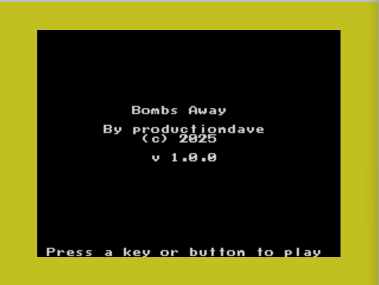
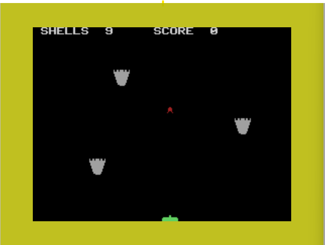

# Bombs Away

Bombs Away is a simple shooter game.  The missiles are raining down on you and
you need to shoot as many of them as you can.  You have a limited number of
shells, so use them wisely.

Shells restock every 10 points but the number of missiles increases too.

You can only shoot one shell at a time.

You can not shoot from the same position twice in a row.

There is no penalty for missing missiles other than you don't score any points.
You are incentivized, therefore, to avoid being hit and occasionally shoot down
missiles.  The number of shells available to you is quite limited.  If you reach
zero shells, the game will be over.

## Screenshots

## Joystick controls

Left and right to move, button to shoot.

## Graphics

The game is a mixture of animated tiles and sprites.  Sprites are used for the
player and the shells that the player shoots.

The falling missiles are animated tiles.

## Animating the missiles

The missile tile patterns are arranged such that there are 4 stages of animation
for each VDP row in the name table.  Each stage is updated at the end of a
frame.  Once the tile has moved through 4 stages of animation, the missile
position in the nametable is incremented to the next horizontal row.

This gives the effect of the missile moving down the screen at 2 pixels per
frame.

## Collision detection

Collision detection only happens on Frame 0.  Doing it this way, makes the
collision detection routines very predictable.  We know precisely where the
pixels of a missile are at frame 0 as the missile graphic covers a 16 x 16 pixel
area. (2 x 2 tiles) at frame 0 only.  The missile is spread over a 2 x 6 tile grid on
subsequent animation frames.

<!-- vim: set ft=markdown tw=80 cc=80: -->
